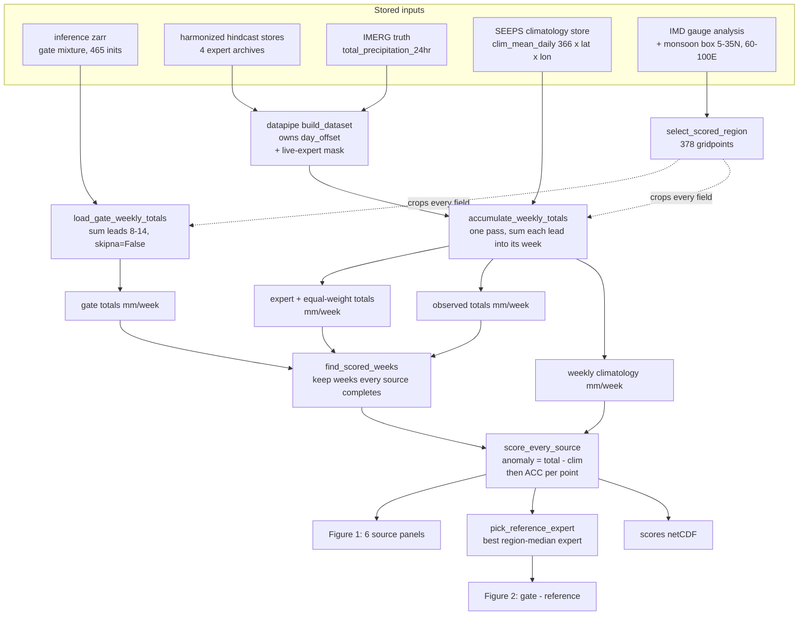

<!--
SPDX-FileCopyrightText: Copyright (c) 2023 - 2026 NVIDIA CORPORATION & AFFILIATES.
SPDX-FileCopyrightText: Copyright (c) 2026 The University of Chicago.
SPDX-FileCopyrightText: All rights reserved.
SPDX-License-Identifier: Apache-2.0
-->

# Week-2 skill panels — per-gridpoint ACC (or RMSE) for every source

Six maps of how well each forecast source predicts **week-2 accumulated
rainfall** over the IMD-gauged monsoon region, plus a second figure showing
where the learned MoWE gate beats its two references. Everything is offline:
no checkpoint is loaded and no GPU is touched, because the gate's forecasts
are read out of the inference zarr that `tools/infer_mowe.py` already wrote.

This is the map version of `tools/plot_week2_acc.py`. That script pools ACC
over *both* the region and the initializations in a month, giving one number
per month per source (a bar chart). This one keeps the gridpoints and
collapses only the initialization axis, so each point answers a different
question: **are this location's wet and dry weeks timed correctly?**

---

## 1. What gets computed

One number per gridpoint per source. Getting there takes four ideas, in
order.

**Weekly totals.** The predictand is a week, not a day. For every
initialization, the seven daily fields at leads 8–14 are summed into one
`mm/week` total — for each expert, for their equal-weight average, for the
gate, and for the IMERG truth. A missing lead **poisons** the whole total
(`skipna=False`) rather than being skipped, so a 6-day forecast sum can never
be compared against a 7-day observation.

**Anomalies.** Raw rainfall totals correlate well simply because everyone
knows it rains in July. To remove that, both the forecast and the truth have
the same **weekly climatology** subtracted — built by summing the *daily*,
day-of-year climatology over the same seven valid days, so the reference has
exactly the shape of the predictand. A monthly climatology is not good
enough: it is a 12-step function, so monsoon onset survives inside each month
and the leftover seasonal march inflates the correlation on both sides.

**Correlation across weeks.** At each gridpoint `x`, correlate the forecast
anomaly series against the observed anomaly series over the initializations:

```text
                sum_i  a_p(i,x) · a_t(i,x)
ACC(x) = ------------------------------------------
         sqrt( sum_i a_p(i,x)²  ·  sum_i a_t(i,x)² )
```

There are deliberately **no cos-latitude weights**. Area weights exist to
stop a spatial *average* from over-counting the poles; a per-gridpoint
correlation has no spatial average in it, and a weight applied at one point
cancels between numerator and denominator.

**A matched sample.** See §4 — this is the step most likely to silently
change the answer.

With `--metric rmse` the same six panels come out in `mm/week` instead.
RMSE is computed on the **raw** totals, not the anomalies: subtracting the
same climatology from both sides leaves the difference unchanged, so the
climatology is irrelevant to it.

## 2. Where the numbers come from



The expert fields go **through the datapipe** rather than being read from the
harmonized stores directly, because two alignment rules live there and are
easy to get wrong by hand:

- per-expert `precip.day_offset` — SFNO's precip head is forward-looking, so
  a given lead maps to a different stored record than it does for Pangu;
- the live-expert mask — an expert missing an init or a lead must contribute
  nothing rather than contributing a zero.

### Four details that are easy to get wrong

These live in the code as one-line markers only; the reasoning is here.

- **Day alignment.** The IMERG record for lead τ sits at `date(init) + (τ-1)`
  — the day *ending* at `init + τ·24h`. The batch's `valid_time` is that
  window's **end** and is one day later, so using it to index the climatology
  shifts the reference by a day (~0.8 mm/week on a ~36 mm/week total).
- **Equal weight averages over the LIVE experts only.** A missing expert is
  not zero rainfall, it is no information. Dividing by the number of live
  experts rather than by four is what makes the blend the mean of what is
  actually available; dividing by four would drag it toward zero on exactly
  the weeks with poor coverage.
- **The difference figure subtracts one fixed expert**, picked by region-median
  score, not a pointwise best over four noisy estimates — a pointwise best
  would bias the reference wherever noise happens to favour one expert.
- **NaN handling in the ACC.** A NaN on either side must not poison the whole
  gridpoint. Both sides are zeroed for those weeks, which contributes nothing
  to either the numerator or the denominator.

## 3. The two figures

Figure 1, `--out` (2 rows × 3 columns, one shared colour scale):

```text
+-----------------+-----------------+-----------------+
| (a) Pangu-S2S   | (b) SFNO-S2S    | (c) GraphCast   |  the four
+-----------------+-----------------+-----------------+  frozen experts
| (d) AIFS        | (e) Equal weight| (f) MoWE gate   |  then the blends
+-----------------+-----------------+-----------------+
   each panel title carries that source's region median
```

Figure 2, `--out-diff` (2 rows × 1 column, diverging about zero):

```text
+-------------------------------+
| (a) MoWE gate - best expert   |   white  = gate ties its reference
+-------------------------------+   blue   = gate better
| (b) MoWE gate - equal weight  |   red    = gate worse
+-------------------------------+   title: "gate better at X% of points"
```

A shared scale on Figure 1 is what makes "this model is bluer than that one"
mean something. A **diverging** scale would be wrong there — barely any
gridpoint has negative ACC, so half the range would go to a sign that hardly
occurs. On Figure 2 diverging is exactly right, because the sign *is* the
question.

**Blue always means better, and better always points up the colourbar.**
Since ACC is better high and RMSE better low, both the colormap and the
colourbar direction flip between metrics. Three traps sit here, each of which
produces a perfectly plausible figure that says the wrong thing:

| trap | what happens |
|---|---|
| `RdYlBu_r` for ACC | matplotlib's `RdYlBu` *already* runs red-low to blue-high, so reversing it paints high skill red |
| forgetting the flip for RMSE | two adjacent figures end up with opposite senses of "good" |
| `np.nanmean(d > 0)` for "% of points where the gate wins" | `NaN > 0` is `False`, not `NaN`, so the mean covers all 837 bounding-box cells instead of the 378 masked ones — reported 29% where the truth was 65% |

## 4. Why `--matched` is the default

The datapipe index takes the **union** of initializations across experts, so
an init present in only some archives is still usable. That makes coverage
badly uneven:

| source | complete weeks (of 465) |
|---|---|
| GraphCast | 365 |
| Pangu-S2S | 280 |
| SFNO-S2S | 280 |
| AIFS | 265 |
| Equal weight / MoWE gate | 465 |

Scoring each source on the weeks it happens to have would compare models on
different samples and flatter whichever one is present on the easier weeks.
`--matched` (the default) keeps only the **175 weeks where every source has
all seven leads**. On this data that choice alone flips the headline result,
so the matched number is the one to quote; `--no-matched` exists to see how
much of a difference it makes, not as an alternative answer.

## 5. Files in this folder

| file | holds |
|---|---|
| [`acc_panels_utils.py`](acc_panels_utils.py) | every number: region mask, loading, weekly accumulation, ACC/RMSE, the matched sample, the netCDF write |
| [`acc_panels_plots.py`](acc_panels_plots.py) | every figure: cartopy axes, the six-panel grid, the difference figure |
| [`plot_week2_acc_panels.py`](plot_week2_acc_panels.py) | the driver — argument parsing, then the steps above in order |
| [`run_week2_acc_panels_derecho.sh`](run_week2_acc_panels_derecho.sh) | Derecho batch wrapper with the paths filled in |

The main script is meant to be read as a summary of the workflow: `main()`
is a numbered list of eight calls. Every "why" lives in the docstring of the
function being called, not in the driver.

Everything accumulates in **float64**. These are sums of seven daily fields
over hundreds of weeks, and the ACC numerator and denominator are sums of
products of anomalies — float32 would lose digits exactly where the
correlation is decided.

## 6. How to run it

### On Derecho (batch, recommended)

The job is **CPU only** — no checkpoint, no GPU — but it does make one full
pass over the validation split (~3.3k `(init, lead)` samples), which is
heavy enough to belong in a job rather than on a login node.

```bash
mkdir -p /glade/derecho/scratch/$USER/mowe_runs     # PBS -o needs the dir
qsub examples/weather/ai_rossbypalooza/tools/acc_panels/run_week2_acc_panels_derecho.sh
```

That writes `week2_acc_panels.png`, `week2_acc_panels_diff.png` and
`week2_acc_panels.nc` into `cfg[rundir]`, and logs to
`cfg[rundir]/week2_acc_panels.log`.

Every path and switch is overridable through `-v`. **PBS's `-v` list is
comma-separated**, exactly like Slurm's `--export`, so a value containing a
comma is truncated — which is why `--region` is not exposed there.

```bash
# the same panels in mm/week instead of ACC
qsub -v metric=rmse .../run_week2_acc_panels_derecho.sh

# the unmatched sample, to a separate file
qsub -v matched=--no-matched,out=/glade/derecho/scratch/$USER/mowe_runs/unmatched.png \
     .../run_week2_acc_panels_derecho.sh

# a different gate checkpoint's forecasts
qsub -v forecast=/glade/derecho/scratch/$USER/mowe_forecasts/other.zarr \
     .../run_week2_acc_panels_derecho.sh
```

| `-v` variable | default |
|---|---|
| `metric` | `acc` (or `rmse`) |
| `matched` | `--matched` (default); `--no-matched` to disable |
| `forecast` | `/glade/derecho/scratch/syback/mowe_forecasts/cv5_physvar.zarr` |
| `dataset_config` | `conf/dataset/hindcast_derecho.yaml` |
| `climatology` | `/glade/derecho/scratch/dboscu/physicsnemo-zarr/normalization/imerg_seeps_climatology_daily.zarr` |
| `cartopy_data` | `/glade/derecho/scratch/dboscu/cartopy_data` |
| `out` | `<rundir>/week2_<metric>_panels.png` |
| `rundir`, `batch_size`, `num_workers` | keys of `cfg` at the top of the script |
| `repo`, `scratch` | plain shell vars above `cfg`; they seed the paths below |

### Directly

```bash
RECIPE=examples/weather/ai_rossbypalooza
NORM=/glade/derecho/scratch/dboscu/physicsnemo-zarr/normalization

python $RECIPE/tools/acc_panels/plot_week2_acc_panels.py \
    --forecast /glade/derecho/scratch/syback/mowe_forecasts/cv5_physvar.zarr \
    --dataset-config $RECIPE/conf/dataset/hindcast_derecho.yaml \
    --climatology $NORM/imerg_seeps_climatology_daily.zarr \
    --cartopy-data /glade/derecho/scratch/$USER/cartopy_data \
    --metric acc \
    --out /glade/derecho/scratch/$USER/mowe_runs/week2_acc_panels.png
```

### Two things that will stop the run

- **`clim_mean_daily` missing.** The shared store
  `$AWIKNER/physicsnemo-zarr/normalization/imerg_seeps_climatology.zarr`
  (base `/glade/derecho/scratch/awikner/`, as in `DATA.md`)
  predates the daily field and carries only the monthly `clim_mean`; the
  script rejects it rather than silently using a monthly reference.
  Regenerate with
  `tools/compute_seeps_climatology.py --years 2000-2019 --daily-half-window 7`
  (training years only, so the validation period never enters the reference).
- **Cartopy has no basemap.** Compute nodes have no outbound network, so
  Natural Earth cannot be fetched on demand. Stage it on a login node and
  point `--cartopy-data` at the directory.

## 7. Measured result (cv5_physvar, matched 175 weeks)

Per-gridpoint medians over the 378 IMD-gauged points:

| source | ACC | RMSE (mm/week) |
|---|---|---|
| Pangu-S2S | 0.126 | 41.2 |
| SFNO-S2S | 0.284 | 35.8 |
| GraphCast | 0.468 | 31.9 |
| AIFS | 0.491 | 32.9 |
| Equal weight | 0.505 | 28.6 |
| **MoWE gate** | **0.530** | **28.3** |

The gate beats AIFS at 65% of points (+0.028 median ACC) and equal-weight at
67% (+0.033); its losses concentrate in the Thar arid margin (73–75°E,
27–29°N) and Kashmir — the driest and least-trained points.

**The metric changes the ranking.** The best single expert is AIFS by ACC but
GraphCast by RMSE, so the two difference figures subtract *different*
references — never say "beats the best model" without naming the metric.
Equal-weight nearly ties the gate on RMSE (0.9% apart, better at only 57% of
points) while losing clearly on ACC (5% apart, 67% of points): averaging four
models damps variance, and RMSE rewards damped variance while ACC does not.
Raw RMSE maps also track rainfall climatology (the Western Ghats and NE India
dominate), so they show where errors are *largest*, not where skill is best.

## 8. Related

- [`../../MOWE.md`](../../MOWE.md) — the gate, the losses, and how to train it.
- [`../../DATA.md`](../../DATA.md) — the harmonized stores these experts come from.
- [`../plot_week2_acc.py`](../plot_week2_acc.py) — the pooled, per-month bar chart.
- [`../misc/plot_week2_acc_map.py`](../misc/plot_week2_acc_map.py) — the gate-only
  map, which needs no datapipe at all.
- [`../misc/plot_expert_panels.py`](../misc/plot_expert_panels.py) — single-case
  expert / weight / blend panels for one initialization.
